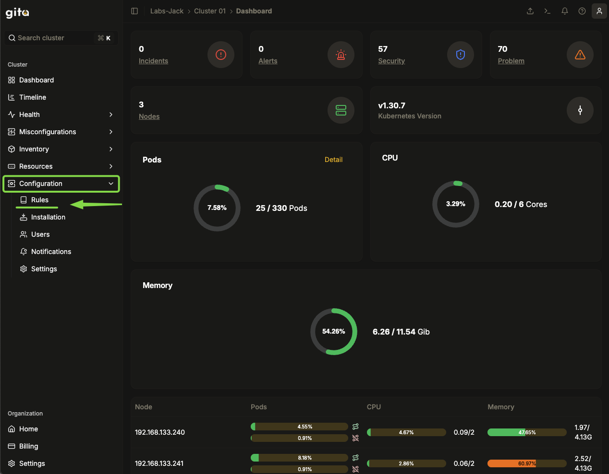
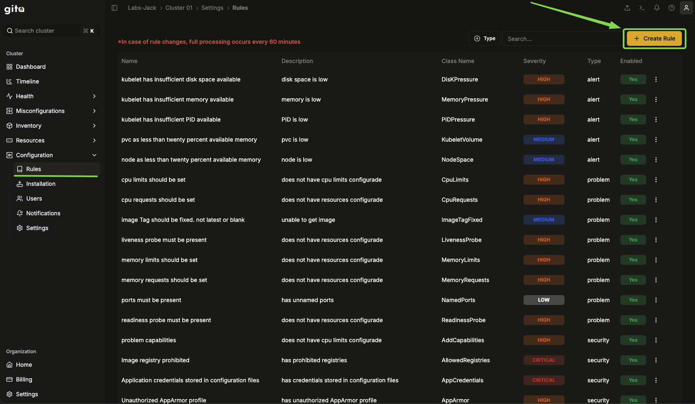
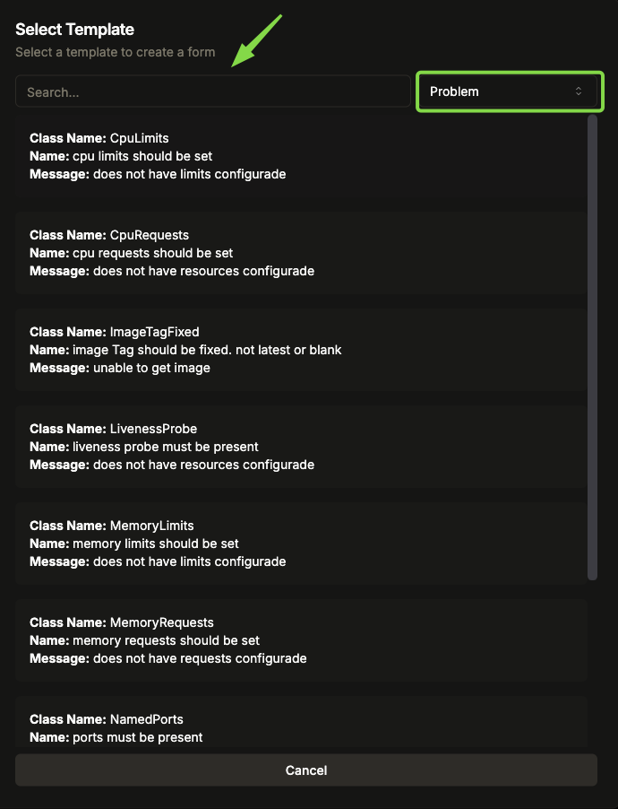
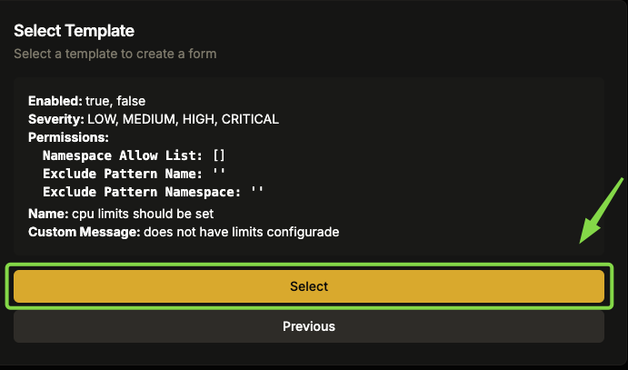
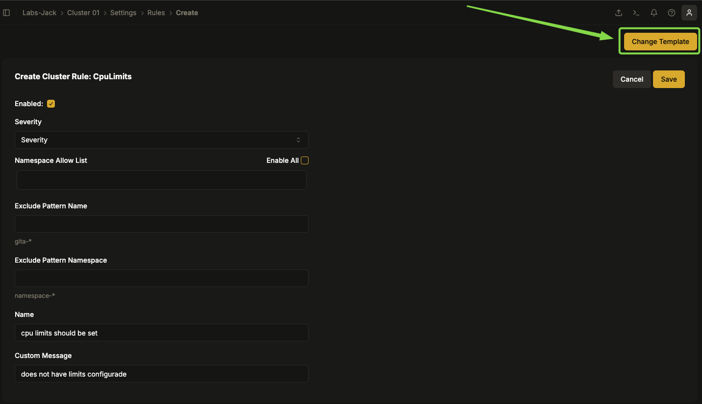
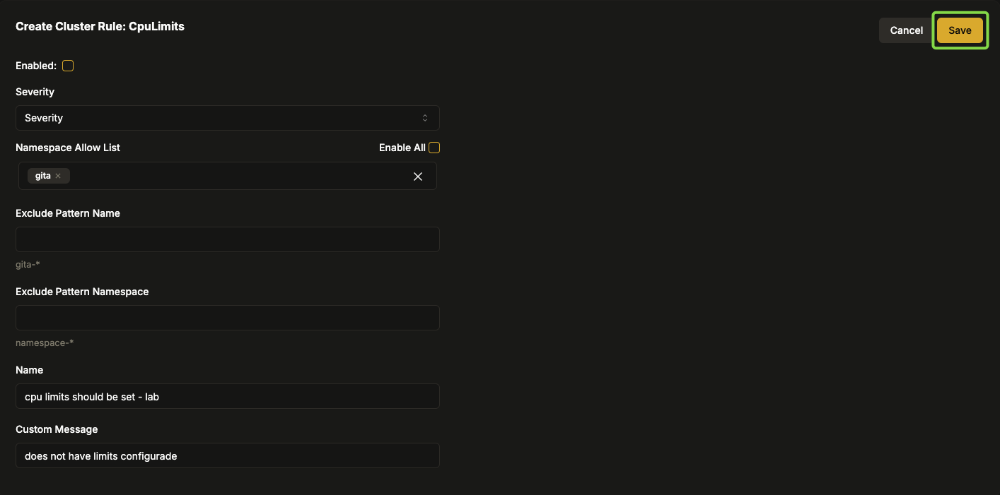
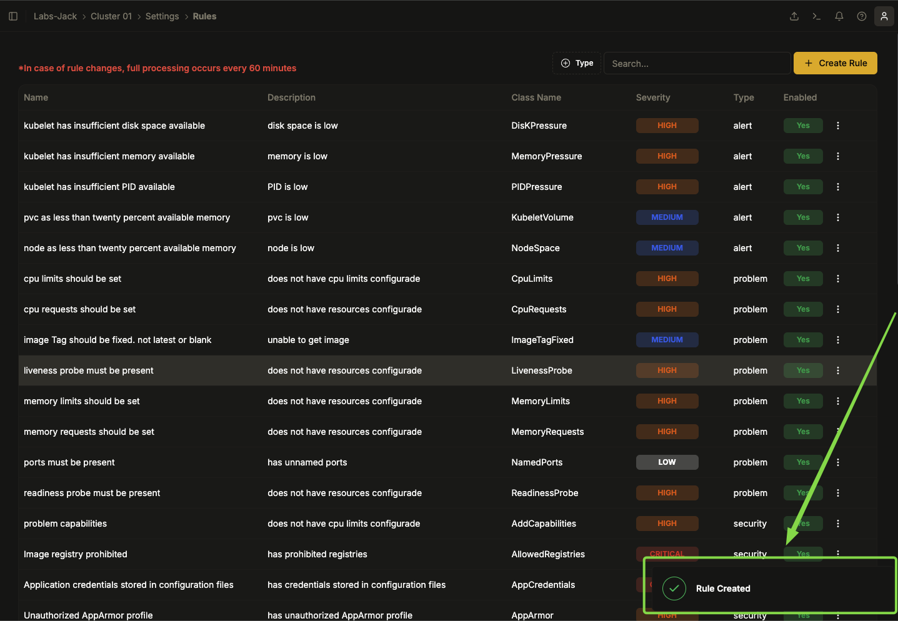
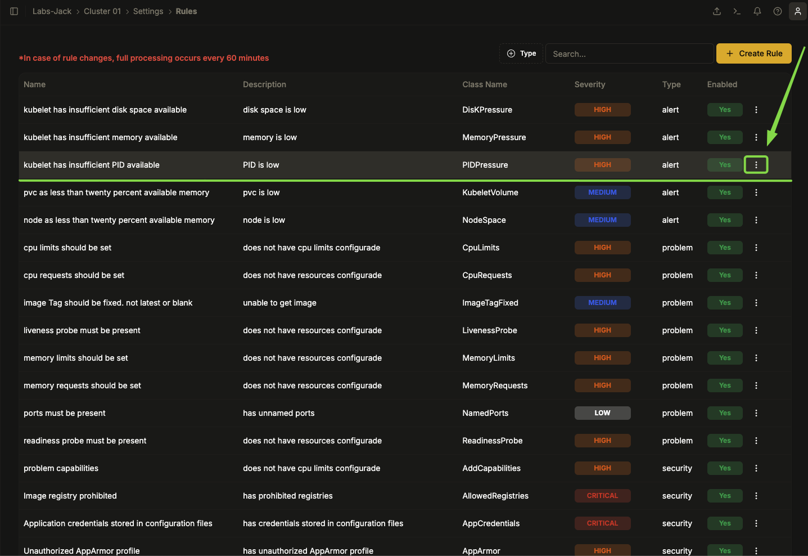
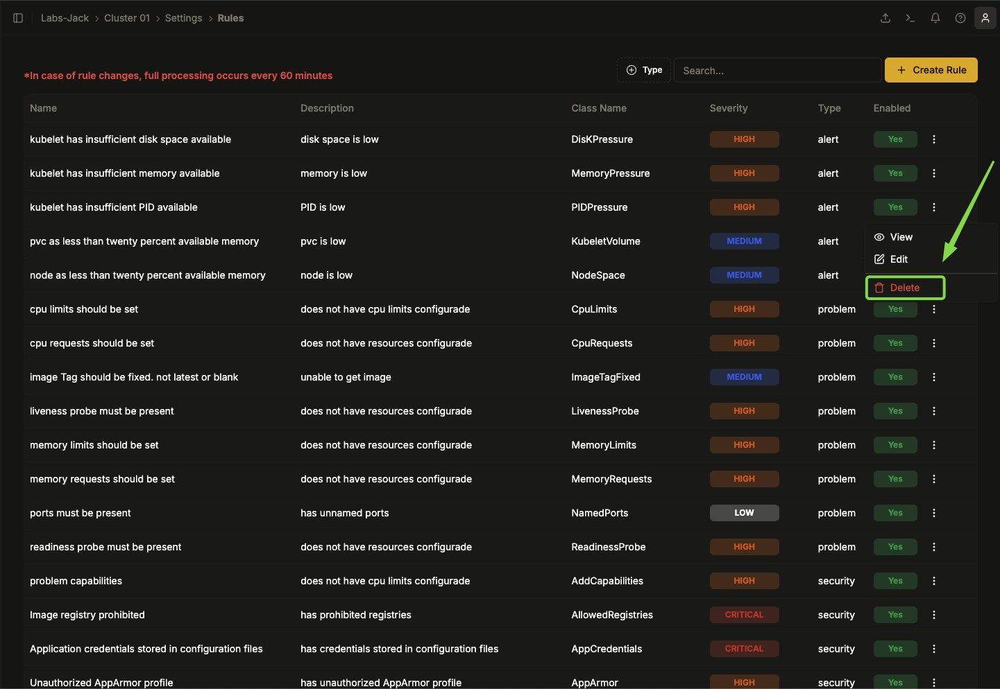
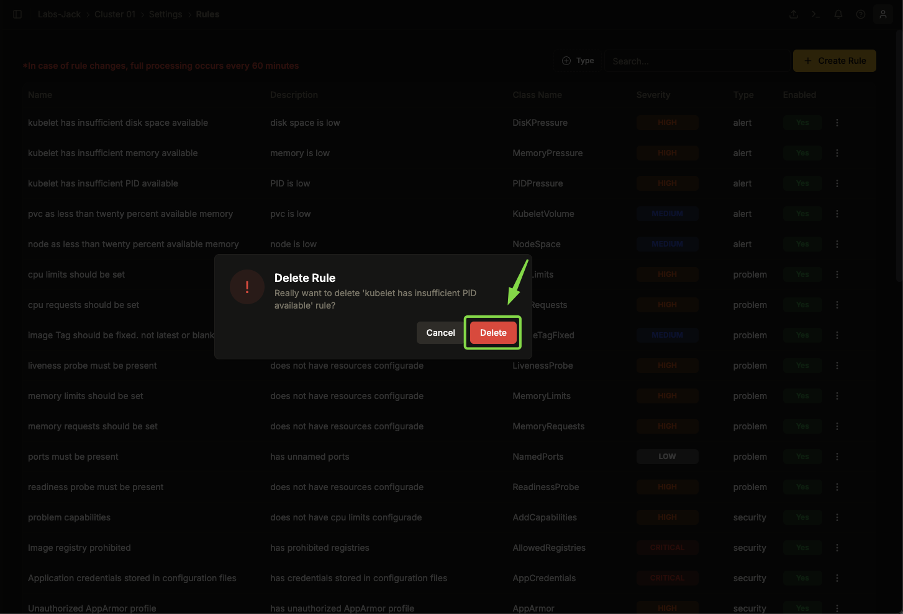

# Criando uma Regra Customizada

Este Procedimento descreve como criar uma regra customizada.
As regras são políticas configuradas no cluster para garantir boas práticas de configuração, segurança e alocação de recursos. Elas ajudam a manter o ambiente estável, seguro e conforme as recomendações do Kubernetes.
---

## Criar uma Regra Customizada

1. **Acesse a interface do sistema.**
2. **Escolha a organização** onde deseja criar a regra.
3. **Selecione o cluster** correspondente.

4. No menu do canto superior esquerdo, vá para **Configuration → Rules**.

   

5. Clique em **Create Rule**.

   

6. Escolha um **template** para a regra desejada.

   

7. É mostrada as opções de configurações do template, clique em **Select** para continuar ou em **Previous** para retornar ao menu anterior de escolha do template.

   

8. Se precisar trocar o template após a escolha, clique em **Change Template**.

   

9.  Preencha os campos:
   - **Enable**: Define se a regra estará ativa ou não.
   - **Severity**:Representa o nível de criticidade da regra, que pode variar de **LOW (Baixa) a CRITICAL (Crítica).**
   - **Namespace Allow List**: Define quais namespaces podem ser afetados por essa regra.
   - **Exclude Pattern Name**: Permite excluir recursos específicos da aplicação da regra.
   - **Exclude Pattern Namespace**: Permite excluir namespaces específicos da aplicação da regra.
   - **Name**: Nome descritivo para a regra.
   - **Custom Message**: Mensagem que será exibida quando a regra for violada.

10. Após revisar, clique em **Save**.

1.  Aguarde a mensagem **Item Created**, confirmando a criação da regra.

---

## Excluir Regra

1. Acesse **Configuration → Rules**.

   

2. Localize a regra que deseja excluir.
3. Clique no ícone **três pontos** ao lado da regra.

   

4. Escolha a opção **Delete**.

   

5. Apos a confirmação "**Delete** regra será **excluída imediatamente**, sem confirmação adicional.

   

---

### Boas Práticas

- **Nomeie as regras** de maneira clara e padronizada.
- **Defina severidade** corretamente para evitar alertas irrelevantes.
- **Revise as regras antes de salvar** para garantir que todas as configurações estão corretas.
- **Utilize templates** adequados para facilitar a configuração.
- **Tenha cuidado ao excluir regras**, pois a ação é irreversível.