# Configuração de Notificações

Este documento descreve como criar um canal de notificação no Gita que permite que o sistema envie alertas automáticos de acordo com as regras definidas para o cluster. Isso garante que eventos críticos, avisos ou informações importantes sejam entregues aos responsáveis no momento certo. A configuração do canal envolve a seleção de eventos, períodos de recebimento e o meio pelo qual a notificação será enviada (ex.: Mattermost, Slack, Webhook, etc.).

---

## Habilitando Notificações

### **1. Acesse a Interface do Sistema**  
  

### **2. Escolha a Organização**  
Selecione a organização onde deseja criar o canal.  
  

### **3. Selecione o Cluster Correspondente**  
Escolha o cluster que receberá as notificações.  
  

### **4. Acesse o Menu Lateral**  
No canto superior esquerdo, abra o menu lateral.  
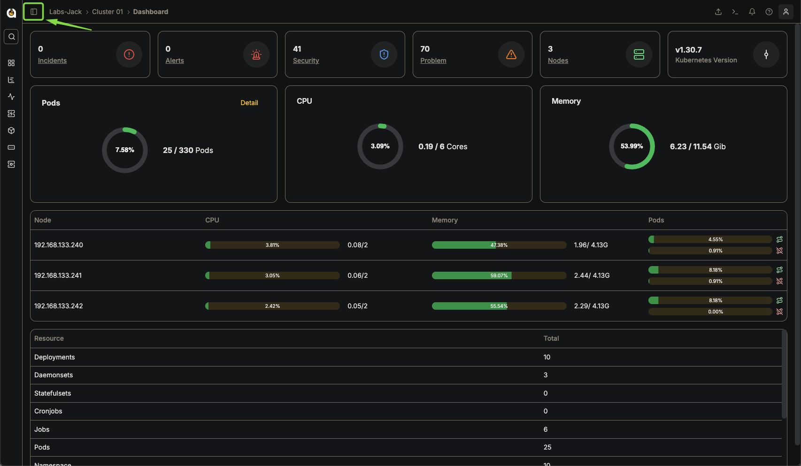  

### **5. Vá para Configuration → Notifications**  
Acesse as configurações de notificação do sistema.  
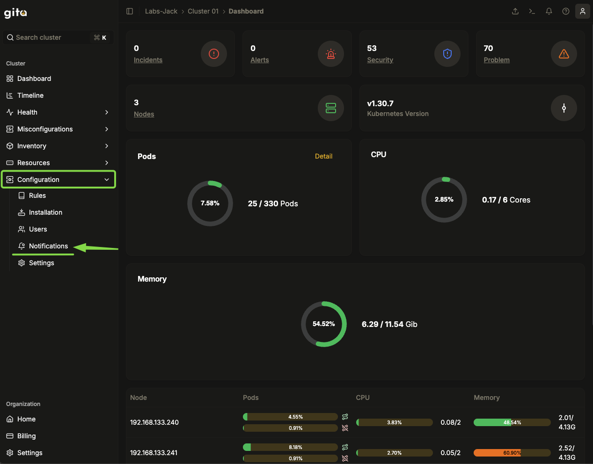  

### **6. Clique em "Create Channel"**  
Inicie a criação do canal de notificação.  
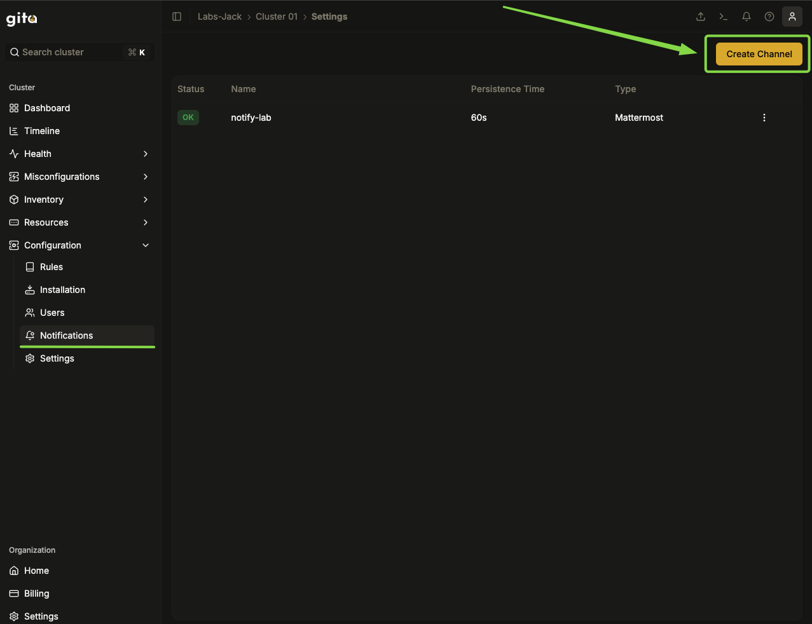  

### **7. Escolha os Eventos a Serem Monitorados**  
- Selecione os eventos que deseja associar ao canal com base na criticidade.  
- Utilize os filtros disponíveis na interface para refinar a seleção.  
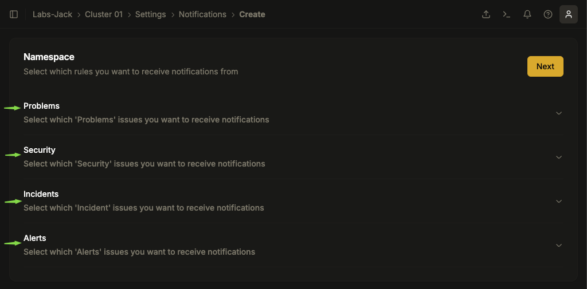  
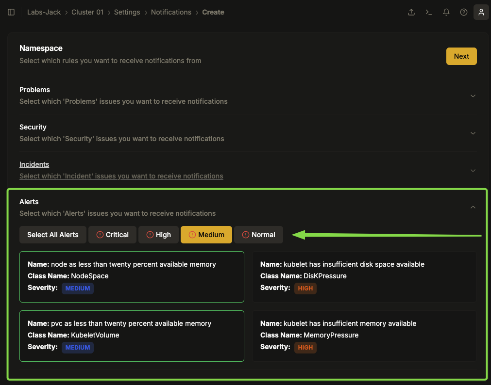  

### **8. Confirme as Regras e Prossiga**  
- Após definir as regras desejadas, clique em **"Next"** no canto superior direito.  
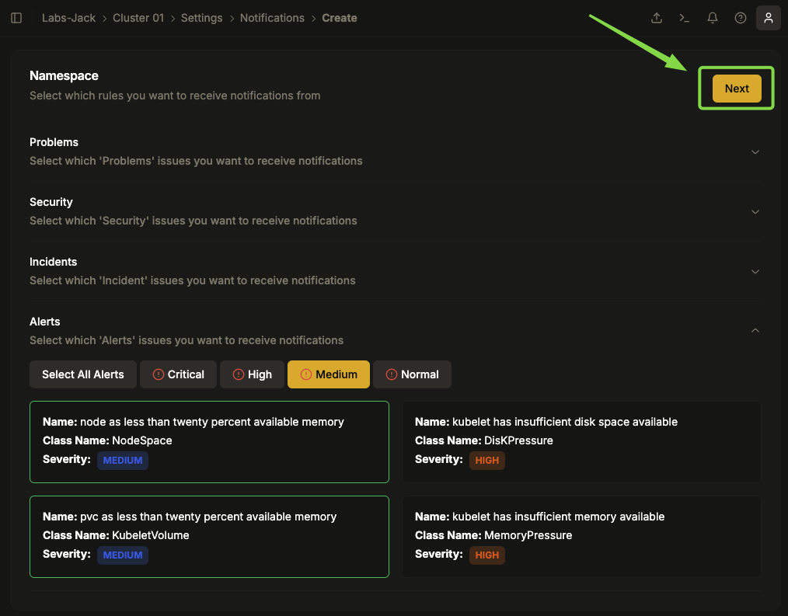  

### **9. Configure o Período de Recebimento das Notificações**  
- Defina os dias da semana e os horários em que deseja receber notificações.  
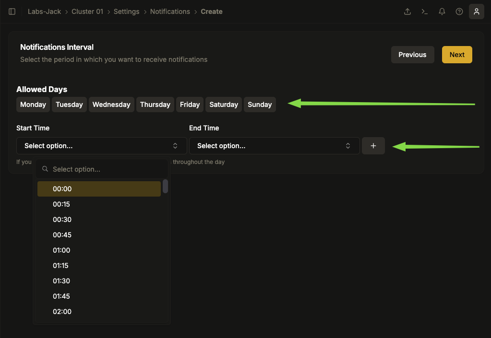  

### **10. Ajuste os Intervalos de Notificação**  
- Configure horários específicos dentro dos dias selecionados.  
- Caso precise excluir um intervalo, clique no ícone da lixeira.  
- Após definir os horários corretamente, clique em **"Next"**.  
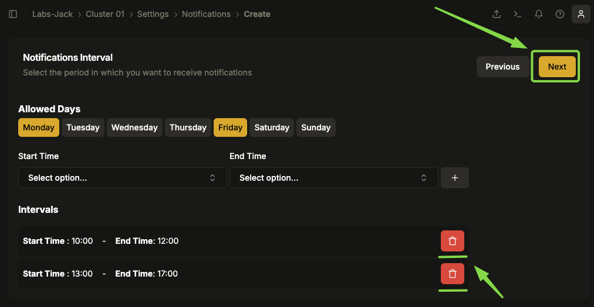  

### **11. Configure o Canal de Notificação**  
- Escolha o canal para o qual as notificações serão enviadas (E-mail, Webhook, etc.).   

### **Preencha os seguintes campos:**  
- **Nome da Notificação**: Nome descritivo para identificação do canal.  
- **Destino**: E-mail, URL do Webhook ou outro meio de recebimento.  
- **Grace Period (seconds)**: Tempo de persistência do evento antes do envio da notificação.  

Após preencher os campos, clique em **"Save"** para concluir.  
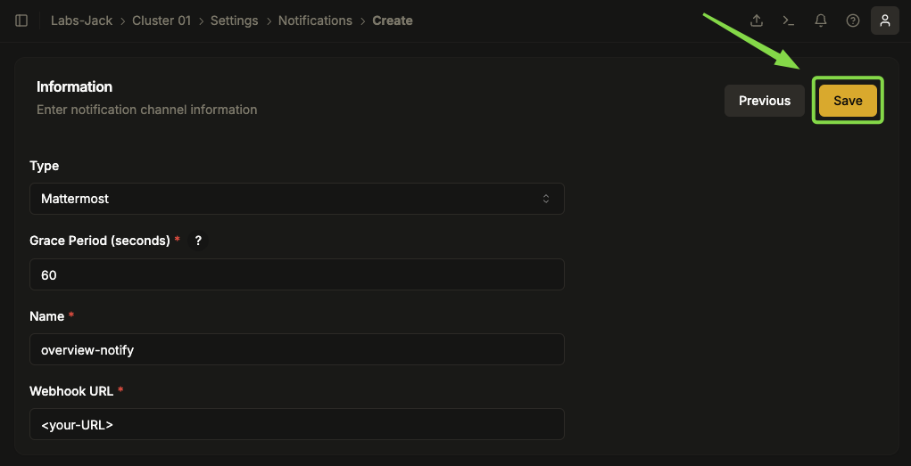  

### **12. Confirme a Ativação das Notificações**  
Aguarde a mensagem de sucesso confirmando que as notificações estão ativas.  
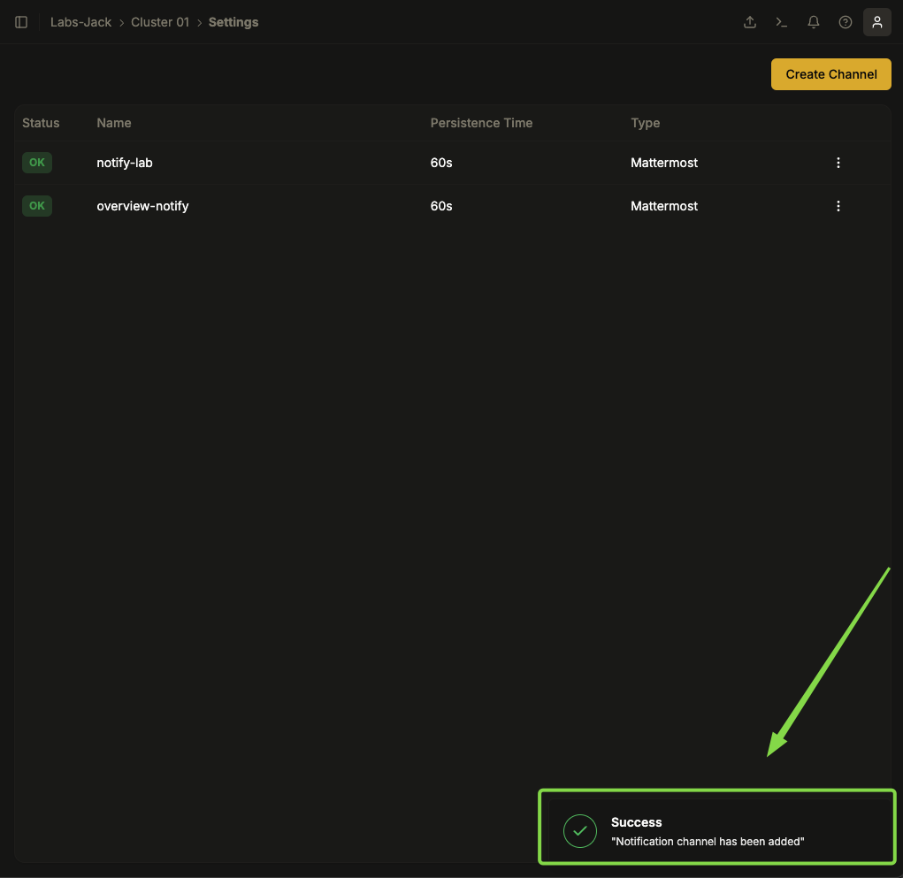  

---

## Editando Notificações

1. **Acesse o painel de gerenciamento de notificações.**
2. Localize a notificação que deseja editar.
1. Clique no ícone de **três pontos** ao lado da notificação desejada.
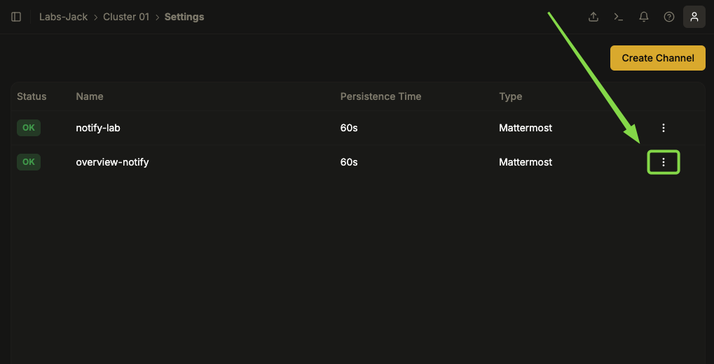

1. Escolha a opção **Edit**.
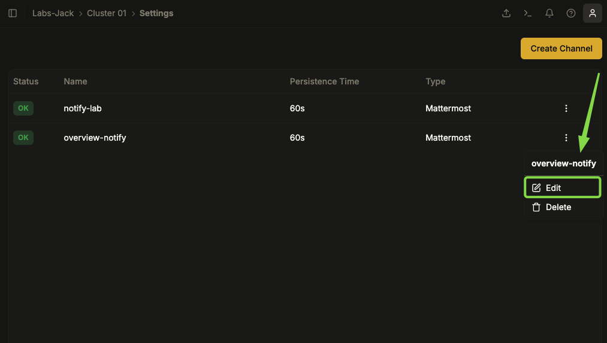
2. Modifique os parâmetros desejados, como:
   - Tipos de eventos monitorados.
   - Canais de comunicação.
   - Regras de período de disparo da notificação.

3. Salve as alterações e aguarde a notificação de edição bem sucedida.

   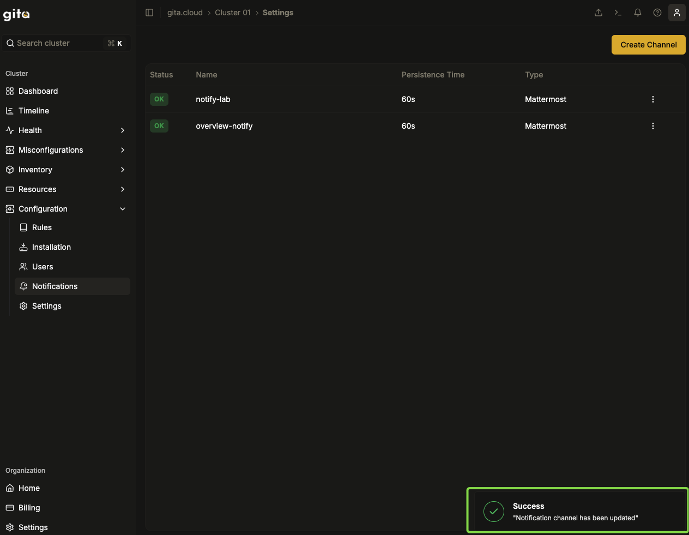

---

## Excluindo Notificações

1. **Acesse o painel de gerenciamento de notificações.**
2. Localize a notificação que deseja excluir.
3. Clique no ícone de **três pontos** ao lado da notificação desejada.

   

4. Escolha a opção **Delete** e confirme a ação.

   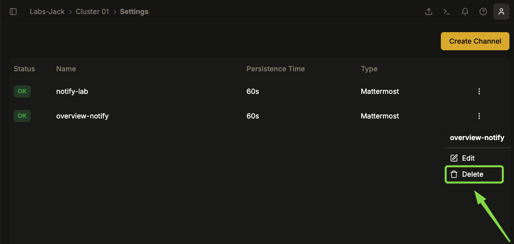

5. Confirme a exclusão e a notificação será excluída imediatamente.

   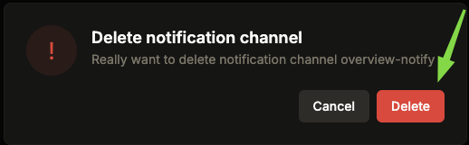

---

## Boas Práticas

- **Ative notificações apenas para eventos críticos** para evitar sobrecarga de alertas.
- **Revise periodicamente as configurações** para garantir que apenas eventos relevantes sejam notificados.
- **Utilize canais de comunicação distintos** para diferentes tipos de alertas.
- **Teste a configuração após qualquer alteração** para garantir que as notificações estão sendo entregues corretamente.
- **Documente quais eventos estão sendo monitorados**, garantindo que a equipe esteja alinhada.