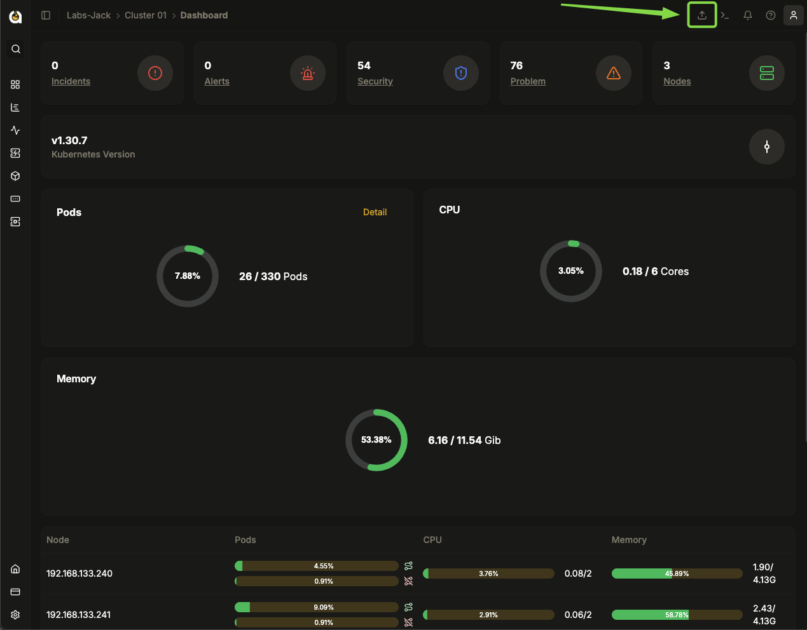
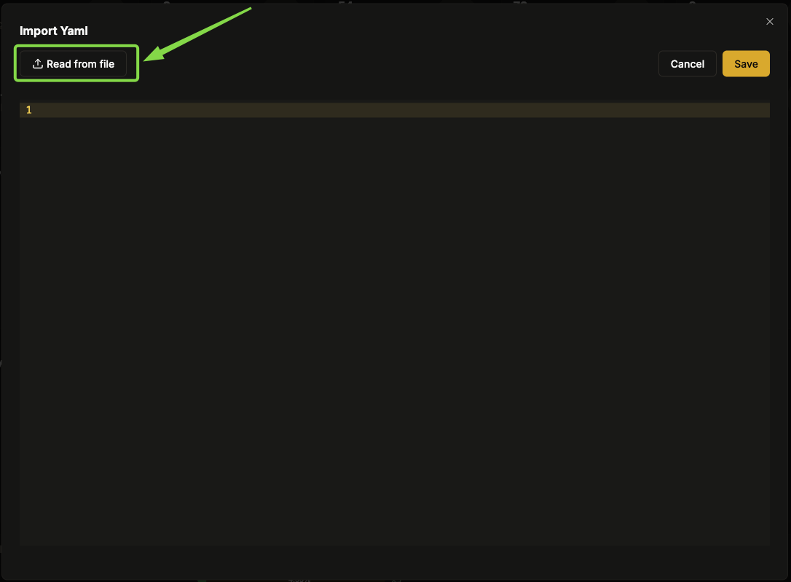
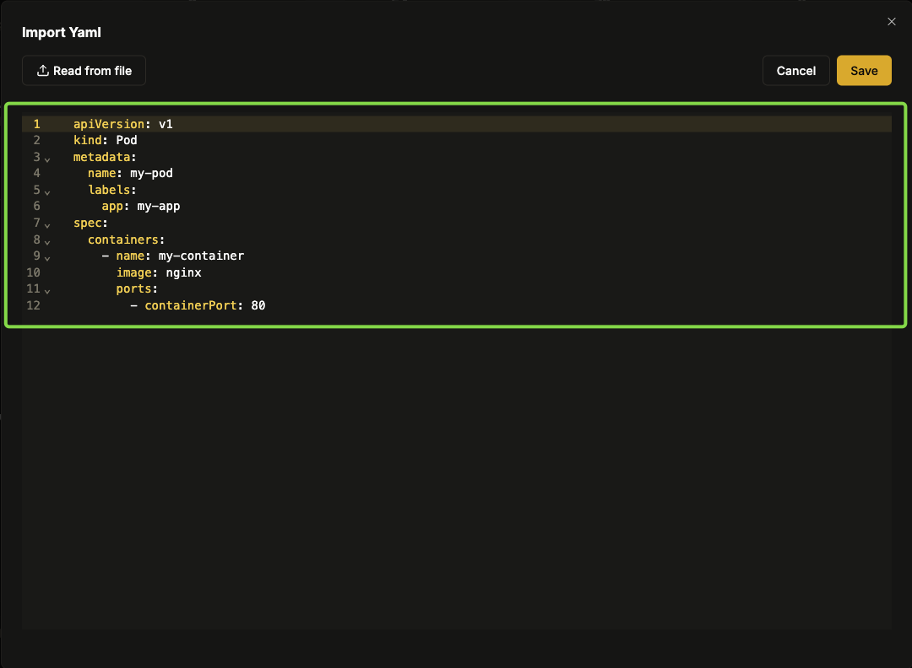
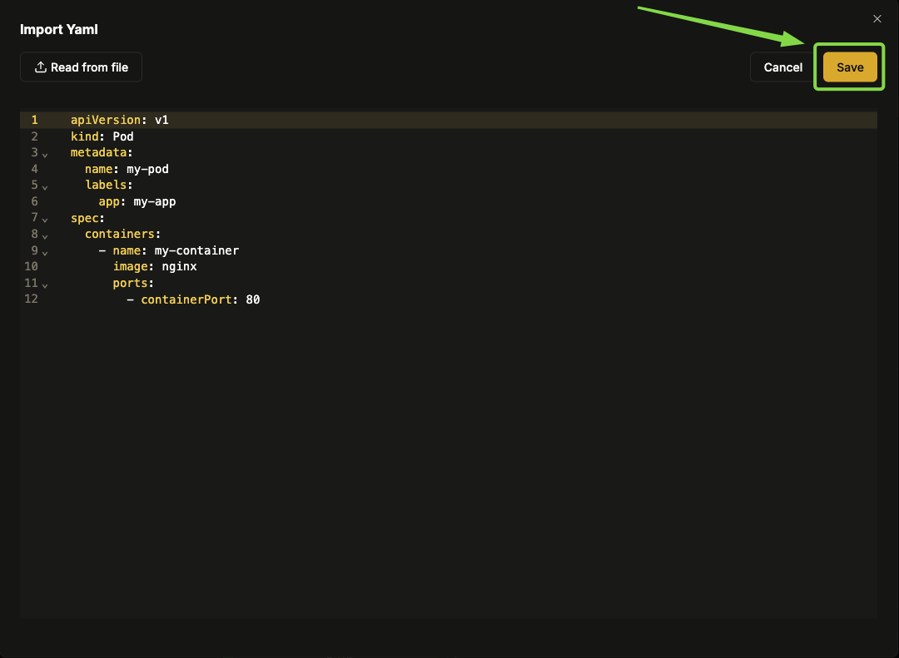
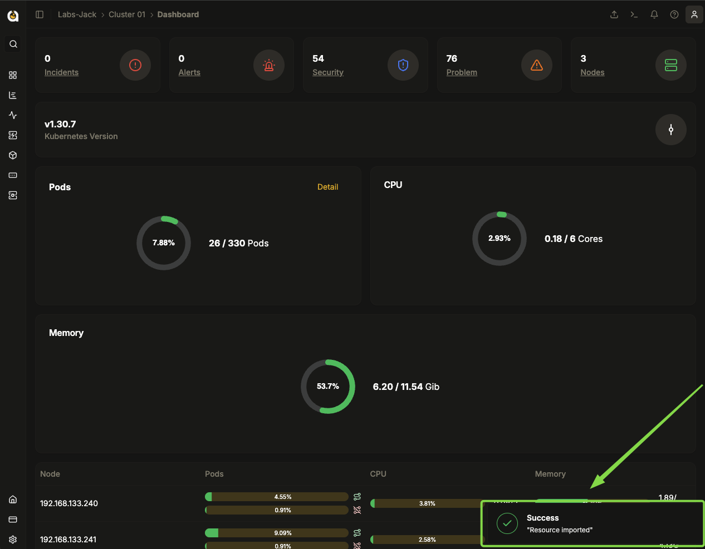

# Como Importar um YAML?

Este Procedimento mostra a importação de um YAML (Yet Another Markup Language) que é um formato utilizado para definir configurações e infraestrutura como código, facilitando a padronização e automação de recursos em um cluster. Importar um YAML permite aplicar configurações como deploys, serviços e permissões de forma eficiente. Durante a importação, ajustes podem ser necessários, como modificar nomes, atualizar imagens de contêiner e definir variáveis de ambiente. Isso garante que a configuração seja adequada ao ambiente antes da aplicação.

---

## 1. Acessando a Plataforma

1. **Faça login** na plataforma com suas credenciais.
2. **Acesse a seção de Organizações** e selecione a organização desejada.
3. **Escolha o Cluster** onde o arquivo será importado.

   

---

## 2. Iniciando a Importação

1. **Localize o ícone de importação** (representado por uma **seta entrando em uma caixa**) na parte superior da interface.
2. **Clique no ícone** para iniciar o processo de importação.

   

---

## 3. Métodos de Importação

Na tela de importação, há duas opções disponíveis:

- **Importação de Arquivo:** Selecione um arquivo YAML existente no seu computador.
- **Edição Manual:** Insira e edite o código YAML diretamente na interface de edição da plataforma.

   

Se optar por um arquivo já criado, ao selecioná-lo, o código será carregado no editor da plataforma para revisão e possíveis ajustes.

---

## 4. Revisão e Confirmação

1. **Verifique se todas as informações estão corretas.**
2. **Se necessário, edite diretamente no editor da plataforma.**
   
3. **Após revisar, clique em Salvar para confirmar a importação.**
   
   

4. Aguarde a mensagem **"Success"**, que confirma que a importação foi realizada com sucesso.
5. **Caso ocorra um erro**, revise o código YAML e tente novamente.

   

---

## 5. Observações Gerais

- **Certifique-se de que o arquivo YAML está formatado corretamente** antes da importação.
- **Se a importação falhar, verifique as mensagens de erro** e ajuste o código conforme necessário.
- **A interface permite edições antes da importação**, garantindo que as configurações estejam corretas.